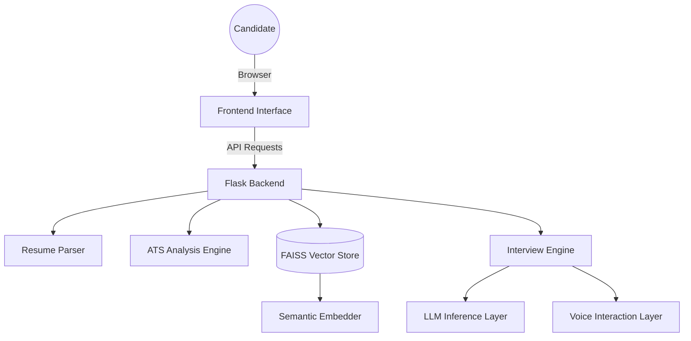

# HireIntel AI

> A premium AI-powered recruitment assistant focused on semantic resume analysis, adaptive interviews, and recruiter-grade candidate evaluation.


---

## Overview

HireIntel AI is a modern recruitment intelligence platform designed to create immersive, conversational hiring experiences.

The platform combines:

* semantic ATS analysis
* adaptive HR and technical interviews
* conversational AI interactions
* contextual memory
* recruiter-grade evaluations
* voice-enabled interview experiences

Built with a strong focus on product quality and UX, the system prioritizes realism, clarity, and premium interaction design over traditional dashboard-heavy recruitment software.

---

## Core Features

### Conversational AI Interviews

* Adaptive HR and technical interview flows
* Context-aware follow-up questioning
* Resume-aware interview generation
* Conversational memory and intelligent probing
* Realistic recruiter-style interactions

### Voice Interview Experience

* Text-to-Speech interviewer responses
* Speech-to-Text candidate input
* Optional hands-free interview mode
* Real-time conversational interaction

### Semantic ATS Intelligence

* Resume parsing with contextual understanding
* Semantic job matching using vector search
* Skill-gap analysis and improvement insights
* Multi-dimensional candidate scoring

### Recruiter-Grade Evaluation System

* Communication and technical depth analysis
* Confidence and reasoning evaluation
* Strategic hiring recommendations
* Candidate improvement roadmap

### Premium Product Experience

* Minimal monochrome interface
* Responsive mobile-first layouts
* Smooth conversational transitions
* Accessible and performance-optimized UI

---

## Technology Stack

### Frontend

* Vanilla JavaScript (ES6+)
* Modern CSS Architecture
* Web Speech API
* Responsive UI System

### Backend

* Flask (Python)
* FAISS Vector Search
* Hugging Face Transformers
* Semantic Embedding Pipeline

### Infrastructure

* Docker
* Docker Compose
* Render / Railway Ready

---

## Architecture Overview



---

## Local Development Setup

### Clone Repository

```bash
git clone https://github.com/deepak050805/HireIntel-AI.git
cd HireIntel-AI
```

### Install Dependencies

```bash
pip install -r requirements.txt
```

### Run Application

```bash
python src/app.py
```

Application runs at:

```text
http://localhost:5000
```

---

## Docker Deployment

### Build & Run

```bash
docker-compose up --build
```

### Access Application

```text
http://localhost:5000
```

---

## Design Philosophy

HireIntel AI follows a restrained, premium SaaS design philosophy inspired by modern productivity and recruitment platforms.

The interface emphasizes:

* clarity
* conversational immersion
* minimalism
* calm interaction design
* recruiter-focused workflows

The experience intentionally avoids:

* cluttered analytics dashboards
* excessive AI visual clichés
* overwhelming enterprise complexity

---

## Project Highlights

* Semantic ATS scoring and candidate analysis
* FAISS-powered vector similarity search
* Adaptive conversational interview engine
* Voice-enabled interview interaction
* Context-aware technical probing
* Recruiter-grade evaluation reports
* Dockerized deployment architecture
* Responsive and accessible UI system

---

## Deployment

The platform is production-ready and can be deployed using:

* Docker
* Render
* Railway
* VPS environments

Detailed deployment instructions are available in:

```text
SETUP.md
docs/launch_handbook.md
```

---

## License

This project is intended for educational, portfolio, and demonstration purposes.

---

## Author

**Deepak Takshak**

AI & Data Science Engineering
Full-Stack AI Development | NLP | Conversational Systems
