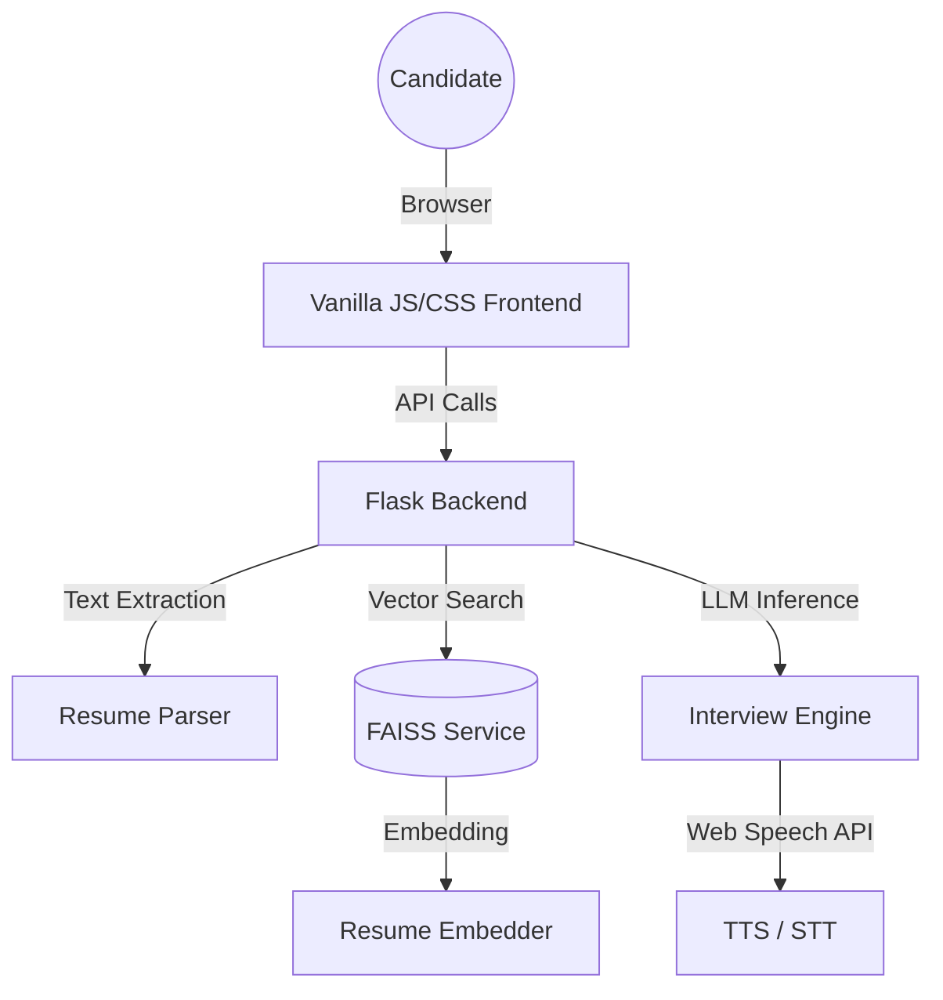

# HireIntel AI - Premium Recruitment Assistant


**HireIntel AI** is a state-of-the-art, immersive AI-powered resume analysis and adaptive interview platform. Designed for modern recruitment, it transitions from robotic chatbots to realistic, conversational AI assistants.

## 🚀 Key Features

### 🎙️ Immersive Voice Interview Experience
*   **Conversational Realism:** Adaptive AI interviewer with natural follow-ups and technical probing.
*   **Web Speech Integration:** Professional Text-to-Speech (TTS) for the interviewer and Speech-to-Text (STT) for candidate input.
*   **Voice Mode:** Optional hands-free interview experience with real-time transcription.

### 🧠 Semantic ATS Intelligence
*   **Resume Parsing:** Robust PDF/DOCX extraction with semantic context-awareness.
*   **Deep Scoring:** Advanced ATS scoring across technical depth, communication, leadership, and cultural fit.
*   **Gap Analysis:** Strategic identification of missing skills and resume formatting improvements.

### 📊 Recruiter-Grade Evaluations
*   **Executive Summaries:** Professional "Recruiter Verdicts" and high-level fit assessments.
*   **Strategic Roadmaps:** Actionable growth steps for candidates based on interview performance.
*   **Match Insights:** Semantic job matching with weighted scoring systems.

## 🛠️ Tech Stack

*   **Frontend:** Vanilla JavaScript (ES6+), Modern CSS (Variables, Grid, Flexbox), Web Speech API.
*   **Backend:** Flask (Python), FAISS (Semantic Vector Search), LLM Integration (Hugging Face Transformers).
*   **Infrastructure:** Docker, Docker-compose, Render/Railway Ready.

## 📦 Installation & Setup

### Local Development
1. Clone the repository:
   ```bash
   git clone https://github.com/your-username/HireIntel-AI.git
   cd HireIntel-AI
   ```
2. Install dependencies:
   ```bash
   pip install -r requirements.txt
   ```
3. Run the application:
   ```bash
   python src/app.py
   ```
4. Access at `http://localhost:5000`

### Docker Deployment
1. Build and run with Docker Compose:
   ```bash
   docker-compose up --build
   ```
2. Access at `http://localhost:5000`

## 🏗️ Architecture Overview

HireIntel AI uses a modular architecture combining a responsive frontend with a Python-based ML backend.



Semantic search is powered by **FAISS**, allowing for near-instant job matching and context retrieval. The interview engine utilizes **Hugging Face** models for generating adaptive questions and evaluating conversational signals.

## 🎨 Design Philosophy
The platform adheres to a **Premium Monochrome** aesthetic, prioritizing visual clarity, high-end SaaS typography, and subtle micro-animations. It avoids "AI clichés" in favor of a calm, professional recruitment environment.

---

*HireIntel AI - Redefining the interview experience with intelligence and immersion.*
