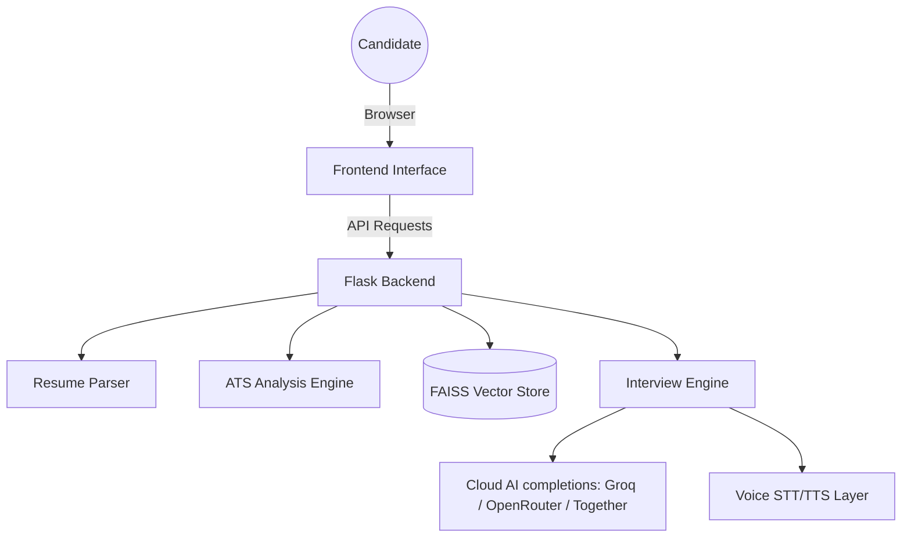

# HireIntel AI

> A premium, production-ready AI-powered recruitment assistant focused on semantic resume analysis, adaptive conversational interviews, and recruiter-grade candidate evaluation.


---

## 🚀 Architectural Update: Lightweight Production SaaS

HireIntel AI has been modernized from heavy, local, transformer-based execution (which consumed gigabytes of RAM and made cloud deployments unstable) to a **lightweight, high-performance API-based architecture**.

* **Ultra-Fast Conversational Inference**: Offloads text generation to cloud APIs like **Groq** (preferred), **OpenRouter**, or **Together AI** utilizing state-of-the-art models (e.g., Llama 3, Mixtral) in milliseconds.
* **Instant Cold Starts**: Embedding models (`all-MiniLM-L6-v2`) are **pre-cached in the Docker image at build stage**. This removes all startup downloads, guaranteeing immediate availability and a 100% success rate on lightweight platforms like **Render (Starter Plan)** or **Railway**.
* **Calm & Premium Aesthetics**: Preserves the complete human-designed monochrome Notion/Linear UI, micro-animations, and full voice-enabled screening rounds while operating with a minimal, SaaS-grade server footprint.

---

## Core Features

### Conversational AI Interviews
* **Adaptive HR rounds**: Focus on motivation, ownership, situational behavior, and organizational fit.
* **Adaptive Technical rounds**: Deep dive into practical problem-solving, architectural choices, and technical trade-offs.
* **Intelligent Weak-Answer Probing**: Automatically detects brief, low-effort replies (e.g. *"yes"*, *"okay"*, *"idk"*) and challenges candidates for depth, evidence, and validation.
* **Conversational Memory**: Builds a context summary of the entire dialogue to enable realistic recruiters follow-up questions.

### Voice Interview Experience
* **Voice Mode**: Fully immersive conversational speech loop.
* **Interviewer Speech (TTS)**: Strips HTML and naturally translates recruiter prompts into calm, paced audio speech.
* **Mic Input (STT)**: Efficient continuous voice recognition with interim transcripts and auto-submission silence detection.

### Semantic ATS Intelligence
* **Resume Parsing**: Contextual extraction of candidate history from PDF/DOCX formats.
* **Semantic Job Match**: FAISS-powered local vector search and keyword alignment.
* **Skill & Gap Signals**: Deep resume review identifying missing sections and role fit recommendations.

---

## Technology Stack

### Frontend
* Vanilla JavaScript (ES6+), Web Speech API, and High-Performance Custom RAF Scroll Loops.
* Modern, responsive monochrome CSS architecture.

### Backend
* **Flask (Python)**: Ultra-lightweight endpoint router.
* **FAISS & Sentence-Transformers**: Pre-cached semantic vector comparison models.
* **Inference Layer**: Lightweight OpenAI-compatible request handlers (supporting Groq, OpenRouter, Together AI).

---

## Architecture Overview



---

## Local Development Setup

### 1. Clone & Navigate
```bash
git clone https://github.com/deepak050805/HireIntel-AI.git
cd HireIntel-AI
```

### 2. Environment Setup
Copy the production environment template:
```bash
cp .env.example .env
```
Edit `.env` to select your provider and configure API Keys:
```env
AI_PROVIDER=groq
GROQ_API_KEY=your_groq_api_key_here
```

### 3. Install Dependencies
```bash
pip install -r requirements.txt
```

### 4. Run Application
```bash
python src/app.py
```
Access the premium portal at [http://localhost:5000](http://localhost:5000).

---

## Docker Deployment

Build and run containerized environments with pre-loaded embeddings:
```bash
docker-compose up --build
```

---

## License

This project is intended for educational, portfolio, and demonstration purposes.

**Author**: Deepak Takshak  
AI & Data Science Engineering  
Full-Stack AI Development | NLP | Conversational Systems
